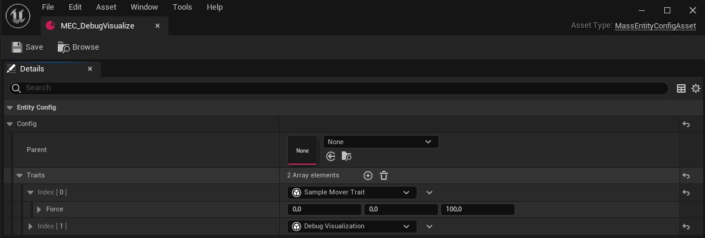

# Community Mass Sample

#### **Authors:**
- Karl Mavko - [@Megafunk](https://github.com/Megafunk)
- Alvaro Jover - [@vorixo](https://github.com/vorixo)

Our **very WIP** understanding of Unreal Engine 5's experimental Entity Component System (ECS) plugin with a small sample project. We are **not** affiliated with Epic Games and this system is actively being changed often so this information might not be totally accurate.

We are totally open to contributions, If something is wrong or you think it could be improved, feel free to [open an issue](https://github.com/Megafunk/MassSample/issues) or submit a [pull request](https://github.com/Megafunk/MassSample/pulls).

Currently built for the Unreal Engine 5 latest version binary from the Epic Games launcher. 
This documentation will be updated often!

#### **Requirements:**
- Unreal Engine 5.0.1 (latest version as of writing) from the [Epic Games launcher](https://www.unrealengine.com/en-US/download)
- `Git` version control:
  - [Windows](https://gitforwindows.org/)
  - [Linux/Unix & macOS](https://git-scm.com/downloads)
- [Git Large File Storage](https://git-lfs.github.com/)

#### **Download instructions (Windows):**
After installing the requirements from above, follow these steps:

1. Right-Click where you wish to hold your project, then press `Git Bash Here`.

2. Within the terminal, clone the project:
	```bash
	git clone https://github.com/Megafunk/MassSample.git
	```

3. Pull LFS:
	```bash
	git lfs pull
	```
4. Once LFS finishes, close the terminal.


**Note:** This project requires `Git LFS` for it to work properly, `zip` downloads **won't work**. 

<!--- Introduce here table of contents -->
<a name="tocs"></a>
## Table of Contents
> 1. [Mass](#mass)  
> 2. [Entity Component System](#ecs)  
> 3. [Sample Project](#sample)  
> 4. [Mass Concepts](#massconcepts)  
> 4.1 [Entities](#mass-entities)   
> 4.2 [Fragments](#mass-fragments)  
> &nbsp;&nbsp;&nbsp;&nbsp;&nbsp;&nbsp;4.2.1 [Shared Fragments](#mass-fragments-sf)  
> 4.3 [Tags](#mass-tags)  
> 4.4 [The archetype model](#mass-arch-mod)   
> &nbsp;&nbsp;&nbsp;&nbsp;&nbsp;&nbsp;4.4.1 [Tags in the archetype model](#mass-arch-mod-tags)  
> &nbsp;&nbsp;&nbsp;&nbsp;&nbsp;&nbsp;4.4.2 [Fragments in the archetype model](#mass-arch-mod-fragments)  
> 4.5 [Processors](#mass-processors)  
> 4.6 [Queries](#mass-queries)  
> &nbsp;&nbsp;&nbsp;&nbsp;&nbsp;&nbsp;4.6.1 [Access requirements](#mass-queries-ar)  
> &nbsp;&nbsp;&nbsp;&nbsp;&nbsp;&nbsp;4.6.2 [Presence requirements](#mass-queries-pr)  
> &nbsp;&nbsp;&nbsp;&nbsp;&nbsp;&nbsp;4.6.3 [Iterating Queries](#mass-queries-iq)  
> &nbsp;&nbsp;&nbsp;&nbsp;&nbsp;&nbsp;4.6.3 [Mutating entities with Defer()](#mass-queries-mq)  
> 4.7 [Traits](#mass-traits)  
> 4.8 [Observers](#mass-o)  
> &nbsp;&nbsp;&nbsp;&nbsp;&nbsp;&nbsp;4.8.1 [Observing multiple Fragment/Tags](#mass-o-mft)       
> 4.10 [Mulitthreading](#mass-mt)  
> 5. Mass common operations    <!-- Proposal -->                  
> 5.1 Spawning an entity                
> 5.2 Destroying an entity
> 6. [Mass Plugins and Modules](#mass-pm)  
> 6.1 [MassEntity](#mass-pm-me)  
> 6.2 [MassGameplay](#mass-pm-gp)  
> 6.3 [MassAI](#mass-pm-ai)  
> 7. [Other Resources](#mass-or)  


<a name="mass"></a>
## 1. Mass
Mass is Unreal's new in-house ECS framework! Technically, [Sequencer](https://docs.unrealengine.com/4.26/en-US/AnimatingObjects/Sequencer/Overview/) already used one internally but it wasn't intended for gameplay code. Mass was created by the AI team at Epic Games to facilitate massive crowd simulations, but has grown to include many other features as well. It was featured in the new [Matrix demo](https://www.unrealengine.com/en-US/blog/introducing-the-matrix-awakens-an-unreal-engine-5-experience) Epic released recently.

<a name="ecs"></a>
## 2. Entity Component System 
Mass is an archetype-based Entity Componenet System. If you already know what that is you can skip ahead to the next section.

In Mass, some ECS terminology differs from the norm in order to not get confused with existing unreal code:
| ECS | Mass |
| ----------- | ----------- |
| Entity | Entity |
| Component | Fragment | 
| System | Processor | 

Typical Unreal Engine game code is expressed as actor objects that inherit from parent classes to change their data and functionality based on what they ***are***. 
In an ECS, an entity is only composed of fragments that get manipulated by processors based on which ECS components they ***have***. 

An entity is really just a small unique identifier that points to some fragments. A Processor defines a query that filters only for entities that have specific fragments. For example, a basic "movement" Processor could query for entities that have a transform and velocity component to add the velocity to their current transform position. 

Fragments are stored in memory as tightly packed arrays of other identical fragment arrangements called archetypes. Because of this, the aforementioned movement processor can be incredibly high performance because it does a simple operation on a small amount of data all at once. New functionality can easily be added by creating new fragments and processors.

Internally, Mass is similar to the existing [Unity DOTS](https://docs.unity3d.com/Packages/com.unity.entities@0.17/manual/index.html) and [FLECS](https://github.com/SanderMertens/flecs) archetype-based ECS libraries. There are many more!

<a name="sample"></a>
## 3. Sample Project
Currently, the sample features the following:

- A bare minimum movement processor to show how to set up processors.
- An example of how to use Mass spawners for zonegraph and EQS.
- Mass-simulated crowd of cones that parades around the level following a ZoneGraph shape with lanes.
- Linetraced projectile simulation example.
- Simple 3d hashgrid for entities.
- Very basic Mass blueprint integration.
- Grouped niagara rendering for entities.


<a name="massconcepts"></a>
## 4. Mass Concepts

#### Sections

> 4.1 [Entities](#mass-entities)  
> 4.2 [Fragments](#mass-fragments)  
> 4.3 [Tags](#mass-tags)  
> 4.4 [The archetype model](#mass-arch-mod)   
> 4.5 [Processors](#mass-processors)  
> 4.6 [Queries](#mass-queries)  
> 4.7 [Traits](#mass-traits)  
> 4.8 [Observers](#mass-o)

<a name="mass-entities"></a>
### 4.1 Entities
Small unique identifiers that point to a combination of [fragments](#mass-fragments) and [tags](#mass-tags) in memory. Entities are mainly a simple integer ID. For example, entity 103 might point to a single projectile with transform, velocity, and damage data.

<a name="mass-fragments"></a>
### 4.2 Fragments
Data-only `UScriptStructs` that entities can own and processors can query on. To create a fragment, inherit from [`FMassFragment`](https://docs.unrealengine.com/5.0/en-US/API/Plugins/MassEntity/FMassFragment/). 

```c++
USTRUCT()
struct MASSSAMPLE_API FLifeTimeFragment : public FMassFragment
{
	GENERATED_BODY()
	float Time;
};
```

With `FMassFragment`s each entity gets its own fragment data, however if we wish to share data across all our entities, we have to use a [shared fragment](#mass-fragments-sf). 

<a name="mass-fragments-sf"></a>
#### 4.2.1 Shared Fragments
A Shared Fragment is a type of Fragment that multiple entities can point to. This is often used for configuration common to a group of entities, like LOD or replication settings. To create a shared fragment, inherit from [`FMassSharedFragment`](https://docs.unrealengine.com/5.0/en-US/API/Plugins/MassEntity/FMassSharedFragment/).

```c++
USTRUCT()
struct MASSSAMPLE_API FClockSharedFragment : public FMassSharedFragment
{
	GENERATED_BODY()
	float Clock;
};
```

In the example above, all the entities containing the `FClockSharedFragment` will see the same `Clock` value. If an entity modifies the `Clock` value, the rest of the entities with this fragment will see the change, as this fragment is shared accross them.

Thanks to this sharing data requirement, the Mass Entity subsystem only needs to store one Shared Fragment for the entities that use it.

<!-- FIXMEVORI: (About the commented phrase below) Probably a bit too technical? Not a performance requirement, we should simply expose API usage. -->
<!-- REVIEWMEFUNK: Shared fragments seem designed around the hashing workflow. It seems pretty important to mention. I will check to make sure that is true... -->
<!-- FIXMEVORI: Mhm, I get it, however this just seems implementation details that the user won't have to handle, as its part of the framework. Will this affect performance or code design? not very likely... -->
<!-- Hashes of the `FMassSharedFragment`'s values are used to find existing shared fragments and to create new ones. -->


<a name="mass-tags"></a>
### 4.3 Tags
Empty `UScriptStructs` that [processors](#mass-processors) can use to filter entities to process based on their presence/absence. To create a tag, inherit from [`FMassTag`](https://docs.unrealengine.com/5.0/en-US/API/Plugins/MassEntity/FMassTag/).

```c++
USTRUCT()
struct MASSSAMPLE_API FProjectileTag : public FMassTag
{
	GENERATED_BODY()
};
```
**Note:** Tags should never contain any member properties.


<a name="mass-arch-mod"></a>
### 4.4 The archetype model
As mentioned previously, an entity is a unique combination of fragments and tags. Mass calls each of these combinations archetypes. For example, given three different combinations used by our entities, we would generate three archetypes:


The `FMassArchetypeData` struct represents an archetype in Mass internally. 

<a name="mass-arch-mod-tags"></a>
#### 4.4.1 Tags in the archetype model
Each archetype (`FMassArchetypeData`) holds a bitset (`TScriptStructTypeBitSet<FMassTag>`) that constains the tag presence information, whereas each bit in the bitset represents whether a tag exists in the archetype or not.

<!-- FIXMEVORI: "Is there a maximum amount of tags limit?" -->


Following the previous example, *Archetype 0* and *Archetype 2* contain the tags: *TagA*, *TagC* and *TagD*; while *Archetype 1* contains *TagC* and *TagD*. Which makes the combination of *Fragment A* and *Fragment B* to be split in two different archetypes.

<a name="mass-arch-mod-fragments"></a>
#### 4.4.2 Fragments in the archetype model
At the same time, each archetype holds an array of chunks (`FMassArchetypeChunk`) with fragment data.

Each chunk contains a subset of the entities included in our archetype where data is organized in a pseudo-[struct-of-arrays](https://en.wikipedia.org/wiki/AoS_and_SoA#Structure_of_arrays) way:


The following Figure represents the archetypes from the example above in memory:


By having this pseudo-[struct-of-arrays](https://en.wikipedia.org/wiki/AoS_and_SoA#Structure_of_arrays) data layout divided in multiple chunks, we are allowing a great number of whole-entities to fit in the CPU cache. 

This is thanks to the chunk partitoning, since without it, we wouldn't have as many whole-entities fit in cache, as the following diagram displays:


In the above example, the Chunked Archetype gets whole-entities in cache, while the Linear Archetype gets all the *A Fragments* in cache, but cannot fit each fragment of an entity.

The Linear approach would be fast if we would only access the *A Fragment* when iterating entities, however, this is almost never the case. Usually, when we iterate entities we tend to access multiple fragments, so it is convenient to have them all in cache, which is what the chunk partitioning provides.

The chunk size (`UE::MassEntity::ChunkSize`) has been conveniently set based on next-gen cache sizes (128 bytes per line and 1024 cache lines). This means that archetypes with more bits of fragment data will contain less entities per chunk.

**Note:** It is relevant to note that a cache miss would be produced every time we want to access a fragment that isn't on cache for a given entity.

<a name="mass-processors"></a>
### 4.5 Processors
Processors combine multiple user-defined [queries](#mass-queries) with functions that compute entities.

Processors are automatically registered with Mass and added to the `EMassProcessingPhase::PrePhsysics` processing phase by default. Each `EMassProcessingPhase` relates to an `ETickingGroup`, meaning that, by default, processors tick every frame in their given processing phase.

Users can configure to which processing phase their processor belongs by modifying the `ProcessingPhase` variable included in `UMassProcessor`: 

| `EMassProcessingPhase` | Related `ETickingGroup` | Description |
| ----------- | ----------- | ----------- |
| `PrePhysics` | `TG_PrePhysics` | Executes before physics simulation starts. |
| `StartPhysics` | `TG_StartPhysics` | Special tick group that starts physics simulation. | 
| `DuringPhysics` | `TG_DuringPhysics` | Executes in parallel with the physics simulation work. | 
| `EndPhysics` | `TG_EndPhysics` |Special tick group that ends physics simulation. | 
| `PostPhysics` | `TG_PostPhysics` |Executes after rigid body and cloth simulation. | 
| `FrameEnd` | `TG_LastDemotable` | Catchall for anything demoted to the end. | 


In their constructor, processors can define rules for their execution order, the processing phase and which type of game clients they execute on:
```c++
UMyProcessor::UMyProcessor()
{
	// This processor is registered with mass by just existing! This is the default behaviour of all processors.
	bAutoRegisterWithProcessingPhases = true;
	// Setting the processing phase explicitly
	ProcessingPhase = EMassProcessingPhase::PrePhysics;
	// Using the built-in movement processor group
	ExecutionOrder.ExecuteInGroup = UE::Mass::ProcessorGroupNames::Movement;
	// You can also define other processors that require to run before or after this one
	ExecutionOrder.ExecuteAfter.Add(TEXT("MSMovementProcessor"));
	// This executes only on Clients and Standalone
	ExecutionFlags = (int32)(EProcessorExecutionFlags::Client | EProcessorExecutionFlags::Standalone);
}
```

On initialization, Mass creates a dependency graph of processors using their execution rules so they execute in order (ie: In the example above we make sure to move our entities before we call `Execute` in `UMyProcessor`).

**Note:** Mass ships with a series of processors that are designed to be inherited and extended with custom logic. ie: The visualization and LOD processors. 

<a name="mass-queries"></a>
### 4.6 Queries
Queries (`FMassEntityQuery`) filter and iterate entities given a series of rules based on Fragment and Tag presence.

Processors can define multiple `FMassEntityQuery`s and should override the `ConfigureQueries` to add rules to the different queries defined in the processor's header:

```c++
void UMyProcessor::ConfigureQueries()
{
	MyQuery.AddTagRequirement<FMoverTag>(EMassFragmentPresence::All);
	MyQuery.AddRequirement<FHitLocationFragment>(EMassFragmentAccess::ReadOnly, EMassFragmentPresence::Optional);
}
```
Queries are executed by calling the `ForEachEntityChunk` member function with a lambda, passing the related `UMassEntitySubsystem` and `FMassExecutionContext`. 

Processors execute queries within their `Execute` function:

```c++
void UMyProcessor::Execute(UMassEntitySubsystem& EntitySubsystem, FMassExecutionContext& Context)
{
	//Note that this is a lambda! If you want extra data you may need to pass it in the [] operator
	MyQuery.ForEachEntityChunk(EntitySubsystem, Context, [](FMassExecutionContext& Context)
	{
		//Loop over every entity in the current chunk and do stuff!
		for (int32 EntityIndex = 0; EntityIndex < Context.GetNumEntities(); ++EntityIndex)
		{
			// ...
		}
	});
}
```
Be aware that the index we employ to iterate entities, in this case `EntityIndex`, doesn't identify uniquely your entities along time, since chunks' disposition may change and an entity that has an index this frame, may be in a different chunk with a different index in the next frame.

**Note:** Queries can also be created and iterated outside processors.

<a name="mass-queries-ar"></a>
#### 4.6.1 Access requirements

Queries can define read/write access requirements for Fragments:

| `EMassFragmentAccess` | Description |
| ----------- | ----------- |
| `None` | No binding required. |
| `ReadOnly` | We want to read the data for the fragment. | 
| `ReadWrite` | We want to read and write the data for the fragment. | 

`FMassFragment`s use `AddRequirement` to add access and presence requirement to our fragments. While `FMassSharedFragment`s employ `AddSharedRequirement`. 

Here are some basic examples in which we add access rules in two Fragments from a `FMassEntityQuery MyQuery`:

```c++	
void UMyProcessor::ConfigureQueries()
{
	// Entities must have an FTransformFragment and we are reading and writing it (EMassFragmentAccess::ReadWrite)
	MyQuery.AddRequirement<FTransformFragment>(EMassFragmentAccess::ReadWrite);
		
	// Entities must have an FMassForceFragment and we are only reading it (EMassFragmentAccess::ReadOnly)
	MyQuery.AddRequirement<FMassForceFragment>(EMassFragmentAccess::ReadOnly);

	// Entities must have a common FClockSharedFragment that can be read and written
	MyQuery.AddSharedRequirement<FClockSharedFragment>(EMassFragmentAccess::ReadWrite);
}
```

`ForEachEntityChunk`s can use the following two functions to access `ReadOnly` or `ReadWrite` fragment data according to the access requirement:

| `EMassFragmentAccess` | Function |Description |
| ----------- | ----------- | ----------- |
| `ReadOnly` | `GetFragmentView` | Returns a read only `TConstArrayView` containing the data of our `ReadOnly` fragment. |
| `ReadWrite` | `GetMutableFragmentView` | Returns a writable `TArrayView` containing de data of our `ReadWrite` fragment. | 

Find below the following two functions employed in context:

```c++
MyQuery.ForEachEntityChunk(EntitySubsystem, Context, [](FMassExecutionContext& Context)
{
	const auto TransformList = Context.GetMutableFragmentView<FTransformFragment>();
	const auto ForceList = Context.GetMutableFragmentView<FMassForceFragment>();

	for (int32 EntityIndex = 0; EntityIndex < Context.GetNumEntities(); ++EntityIndex)
	{
		FTransform& TransformToChange = TransformList[EntityIndex].GetMutableTransform();
		const FVector DeltaForce = Context.GetDeltaTimeSeconds() * ForceList[EntityIndex].Value;
		TransformToChange.AddToTranslation(DeltaForce);
	}
});
```

**Note:** Tags do not have access requirements since they don't contain data.

<a name="mass-queries-pr"></a>
#### 4.6.2 Presence requirements
Queries can define presence requirements for Fragments and Tags:

| `EMassFragmentPresence` | Description |
| ----------- | ----------- |
| All | All of the required fragments/tags must be present. Default presence requirement. |
| Any | At least one of the fragments/tags marked any must be present. | 
| None | None of the required fragments/tags can be present. | 
| Optional | If fragment/tag is present we'll use it, but it does not need to be present. | 

##### 4.6.2.1 Presence requirements in Tags
To add presence rules to Tags, use `AddTagRequirement`.   
```c++
void UMyProcessor::ConfigureQueries()
{
	// Entities are considered for iteration without the need of containing the specified Tag
	MyQuery.AddTagRequirement<FOptionalTag>(EMassFragmentPresence::Optional);
	// Entities must at least have the FHorseTag or the FSheepTag
	MyQuery.AddTagRequirement<FHorseTag>(EMassFragmentPresence::Any);
	MyQuery.AddTagRequirement<FSheepTag>(EMassFragmentPresence::Any);
}
```

`ForEachChunk`s can use `DoesArchetypeHaveTag` to determine if the current archetype contains the the Tag:

```c++
MyQuery.ForEachEntityChunk(EntitySubsystem, Context, [](FMassExecutionContext& Context)
{
	if(Context.DoesArchetypeHaveTag<FOptionalTag>())
	{
		// I do have the FOptionalTag tag!!
	}

	// Same with Tags marked with Any
	if(Context.DoesArchetypeHaveTag<FHorseTag>())
	{
		// I do have the FHorseTag tag!!
	}
	if(Context.DoesArchetypeHaveTag<FSheepTag>())
	{
		// I do have the FSheepTag tag!!
	}
});
```

##### 4.6.2.2 Presence requirements in Fragments
Fragments and shared fragments can define presence rules in an additional `EMassFragmentPresence` parameter through `AddRequirement` and `AddSharedRequirement`, respectively.

```c++
void UMyProcessor::ConfigureQueries()
{
	// Entities are considered for iteration without the need of containing the specified Fragment
	MyQuery.AddRequirement<FMyOptionalFragment>(EMassFragmentAccess::ReadWrite, EMassFragmentPresence::Optional);
	// Entities must at least have the FHorseFragment or the FSheepFragment
	MyQuery.AddRequirement<FHorseFragment>(EMassFragmentAccess::ReadWrite, EMassFragmentPresence::Any);
	MyQuery.AddRequirement<FSheepFragment>(EMassFragmentAccess::ReadWrite, EMassFragmentPresence::Any);
}
```

`ForEachChunk`s can use the length of the `Optional`/`Any` fragment's `TArrayView` to determine if the current chunk contains the Fragment before accessing it:

```c++
MyQuery.ForEachEntityChunk(EntitySubsystem, Context, [](FMassExecutionContext& Context)
{
	const auto OptionalFragmentList = Context.GetMutableFragmentView<FMyOptionalFragment>();
	const auto HorseFragmentList = Context.GetMutableFragmentView<FHorseFragment>();	
	const auto SheepFragmentList = Context.GetMutableFragmentView<FSheepFragment>();
	for (int32 i = 0; i < Context.GetNumEntities(); ++i)
	{
		// An optional fragment array is present in our current chunk if the OptionalFragmentList isn't empty
		if(OptionalFragmentList.Num() > 0)
		{
			// Now that we know it is safe to do so, we can compute
			OptionalFragmentList[i].DoOptionalStuff();
		}

		// Same with fragments marked with Any
		if(HorseFragmentList.Num() > 0)
		{
			HorseFragmentList[i].DoHorseStuff();
		}
		if(SheepFragmentList.Num() > 0)
		{
			SheepFragmentList[i].DoSheepStuff();
		}		
	}
});
```
<!-- REVIEWMEVORI: Maybe move to mass common operations!! Spawning/Destroying subsections, although I think that wouldn't hurt having this here, and then referencing it back in the common mass operation section -->
<a name="mass-queries-mq"></a>
#### 4.6.3 Mutating entities with Defer()
                                                        
Within the `ForEachEntityChunk` we have access to the current execution context. `FMassExecutionContext` enables us to get entity data and mutate their composition. The following code adds the tag `FIsRedTag` to any entity that has a color fragment with its `Color` property set to `Red`:

<!-- FIXMEVORI: Do you think this example is appropriate? Or can we find a better one? -->

```c++
EntityQuery.ForEachEntityChunk(EntitySubsystem, Context, [&,this](FMassExecutionContext& Context)
{
	auto ColorList = Context.GetFragmentView<FSampleColorFragment>();

	for (int32 EntityIndex = 0; EntityIndex < Context.GetNumEntities(); ++EntityIndex)
	{

		if(ColorList[EntityIndex].Color == FColor::Red)
		{
			// Adding a tag to this entity after processing                                     
			Context.Defer().AddTag<FIsRedTag>(Context.GetEntity(EntityIndex));
		}
	}

});
```

##### 4.6.3.1 Basic mutation operations
The following Listings define the native mutations that you can defer:

Fragments:
```c++
Context.Defer().AddFragment<FMyTag>(Entity);
Context.Defer().RemoveFragment<FMyTag>(Entity);
```

Tags:
```c++
Context.Defer().AddTag<FMyTag>(Entity);
Context.Defer().RemoveTag<FMyTag>(Entity);
```
 
Destroying entities:
```c++
Context.Defer().DestroyEntity(MyEntity);
Context.Defer().BatchDestroyEntities(MyEntitiesArray);
```

##### 4.6.3.2 Advanced mutation operations
There is a set of `FCommandBufferEntryBase` commands that can be used to defer some more useful entity mutations. The following subsections provide an overview. 

###### 4.6.3.2.1 `FMassCommandAddFragmentInstanceList`
Defers a list of Fragment mutations over an entity using `FStructView`s and/or `FConstStructView`s.

In the example below we mutate the `FHitResultFragment` with HitResult data, and a `FSampleColorFragment` fragment with a new color.

```c++
FConstStructView HitResulStruct = FConstStructView::Make(FHitResultFragment(HitResult));
FStructView ColorStruct = FStructView::Make(FSampleColorFragment(Color));

Context.Defer().PushCommand(FMassCommandAddFragmentInstanceList(Entity, 
	{HitResulStruct, ColorStruct}
));
```

<!-- FIXMEVORI: Careful! This command might change its name in the future as its currently out of convention (FMass...)-->
##### 4.6.3.2.2 `FCommandAddFragmentInstance` (Singular)
Identical to `FMassCommandAddFragmentInstanceList` but it takes a single Fragment as input instead of a list.
```c++
FConstStructView HitResulStruct = FConstStructView::Make(FHitResultFragment(HitResult));

Context.Defer().PushCommand(FCommandAddFragmentInstance(Entity, HitResulStruct));
```

<!--(check) FIXMEFUNK when does FStructView being const matter? Should this use a different code style or not?-->
<!-- FIXMEVORI: Simple, FStructView can be mutated once created, and FConstStructView can't. (Just checked, hehe)-->

##### 4.6.3.2.3 `FBuildEntityFromFragmentInstances`
Creates an entity given a list of initialized Fragments using `FStructView`s and/or `FConstStructView`s.

In the example below, we inline the `FStructView`s:
```c++
FSampleColorFragment ColorFragment;
ColorFragment.Color = FColor::Green;

FTransformFragment TransformFragment;
TransformFragment.SetTransform(SpawnTransform);

Context.Defer().PushCommand(FBuildEntityFromFragmentInstances(Entity,
	{FStructView::Make(ColorFragment),FStructView::Make(ThingyFragment)}
));
```
##### 4.6.3.2.4 `FBuildEntityFromFragmentInstance` (singular)
Identical to `FBuildEntityFromFragmentInstances` but it takes a single Fragment as input instead of a list.
```c++
FConstStructView ColorStruct = FConstStructView::Make(FSampleColorFragment(HitResult));

Context.Defer().PushCommand(FBuildEntityFromFragmentInstance(Entity, ColorStruct));
```

##### 4.6.3.2.5 `FCommandSwapTags`
Removes the first tag (`FOffTag` in this example) and adds the second to the entity. (`FOnTag`)

```c++
Context.Defer().PushCommand(FCommandSwapTags(Entity, 
	FOffTag::StaticStruct(), 
	FOnTag::StaticStruct()
	));
```

##### 4.6.3.2.6 `FCommandRemoveComposition`
<!--(check) FIXMEFUNK wait... we should mention this in the archetype section!! -->
<!--(check) FIXMEFUNK also, this example is a little contrived? -->
<!-- FIXMEVORI: Requires offline discussion -->
<!-- FIXMEVORI: I'm reviewing from this to down later. -->

The `FMassArchetypeCompositionDescriptor` is a struct that defines a set of fragments and tags that make up an archetype. For example, we can get one from a given archetype handle or template. In this example we get one from a `UMassEntityConfigAsset` pointer.

```c++
const FMassEntityTemplate* EntityTemplate = 
	EntityConfig->GetConfig().GetOrCreateEntityTemplate(*Owner, *EntityConfig);
	
const FMassArchetypeCompositionDescriptor& Composition = EntityTemplate->GetCompositionDescriptor();
	
Context.Defer().PushCommand(FCommandRemoveComposition(Entity, Composition));
```

<!-- FIXMEFUNK: Add the lambda one in here!!!! -->


Note that the commands that mutate entities change the value of ECommandBufferOperationType in their decleration in order to pass their changes to relevant observers when commands are flushed. They also manually add their changes to the observed changes list by implementing `AppendAffectedEntitiesPerType`. 

##### 4.6.3.2.7 Custom mutation operations
It is possible to create custom mutations by implementing your own commands derived from `FCommandBufferEntryBase`.

```c++
Context.Defer().EmplaceCommand<FMyCustomComand>(...)
```

<!-- FIXMEVORI: Provide example of custom commands and when they would be useful -->

<a name="mass-traits"></a>
### 4.7 Traits
Traits are C++ defined objects that declare a set of Fragments, Tags and data for authoring new entities in a data-driven way. 

To start using traits, create a `DataAsset` that inherits from 
`MassEntityConfigAsset` and add new traits to it. Each trait can be expanded to set properties if it has any. 

In addition, it is possible to inherit Fragments from another `MassEntityConfigAsset` by setting it in the `Parent` field.



Between the many built-in traits offered by Mass, we can find the `Assorted Fragments` trait, which holds an array of `FInstancedStruct` that enables adding Fragments to this trait from the editor without the need of creating a new C++ Trait. 


<!-- FIXME: Please elaborate -->
<!-- REVIEWMEFUNK kind of hard to talk about it too much here with the other section existing -->
Traits are often used to add Shared Fragments in the form of settings. For example, our visualization traits save memory by sharing which mesh they are displaying, parameters etc. Configs with the same settings will share the same Shared Fragment.


#### 4.7.1 Creating a trait
Traits are created by inheriting `UMassEntityTraitBase` and overriding `BuildTemplate`. Here is a very basic example:

```c++
UCLASS(meta = (DisplayName = "Debug Printing"))
class MASSSAMPLE_API UMSDebugTagTrait : public UMassEntityTraitBase
{
	GENERATED_BODY()
public:
	virtual void BuildTemplate(FMassEntityTemplateBuildContext& BuildContext, UWorld& World) const override
	{
		// Adding a tag
		BuildContext.AddTag<FMassSampleDebuggableTag>();
		
		// Adding a fragment
		BuildContext.AddFragment<FTransformFragment>();

		// _GetRef lets us mutate the fragment
		BuildContext.AddFragment_GetRef<FSampleColorFragment>().Color = UserSetColor;
	};

	// Editable in the editor
	UPROPERTY(EditAnywhere)
	FColor UserSetColor;
};
```
<!-- FIXMEVORI: What do you mean by bookkeeping? Maybe clarify? -->
 <!--REVIEWMEFUNK Now "fairly simple UObjects that occasionally have extra code to make sure the fragments are all valid and set correctly. "-->

**Note:** We recommend looking at the many existing traits in this sample and the mass modules for a better overview. For the most part, they are fairly simple UObjects that occasionally have extra code to make sure the fragments are all valid and set correctly. 


 <!--REVIEWMEFUNK moved it up to this section "-->
##### Shared Fragments

 Here is a partial `BuildTemplate` example for adding a shared struct, which can do some extra work to see if a shared fragment identical to the new one already exists:
```c++

	//Create the actual fragment struct and set up the data for it however you like 
	FMySharedSettings MyFragment;
	MyFragment.MyValue = UserSetValue;

	//Get a hash of a FConstStructView of said fragment and store it
	uint32 MySharedFragmentHash = UE::StructUtils::GetStructCrc32(FConstStructView::Make(MyFragment));
	
	//Search the Mass Entity subsystem for an identical struct with the hash. If there are none, make a new one with the set fragment.
	FSharedStruct MySharedFragment = 
		EntitySubsystem->GetOrCreateSharedFragment<FMySharedSettings>(MySharedFragmentHash, MyFragment);

	//Finally, add the shared fragment to the BuildContext!
	BuildContext.AddSharedFragment(MySharedFragment);
```


#### 4.7.2 Validating traits
<!-- FIXMEVORI: Clarify and provide example. I'll rewrite it once all the info is in place :) -->
There is also a `ValidateTemplate` overridable function which appears to just let you create your own validation for the trait that can raise errors or even change the buildcontext if need be. This is called after `BuildTemplate` is called for all of the traits of the current template.


In this snippet, we check if a field of the trait is null and print an error:
```c++
void UMSNiagaraRepresentationTrait::ValidateTemplate(FMassEntityTemplateBuildContext& BuildContext, UWorld& World) const
{
	//If our shared niagara system is null, show an error!
	if (!SharedNiagaraSystem)
	{
		UE_VLOG(&World, LogMass, Error, TEXT("SharedNiagaraSystem is null!"));
		return;
	}
}
```


<a name="mass-o"></a>
### 4.8 Observers
The `UMassObserverProcessor` is a type of processor that operates on entities that have just performed a `EMassObservedOperation` over the Fragment/Tag type observed:

| `EMassObservedOperation` | Description |
| ----------- | ----------- |
| Add | The observed Fragment/Tag was added to an entity. |
| Remove | The observed Fragment/Tag was removed from an entity. | 

Observers do not run every frame, but every time a batch of entities is changed in a way that fulfills the observer requirements.

For example, you could create an observer that handles entities that just had an `FColorFragment` added to change their color:

```c++
UMSObserverOnAdd::UMSObserverOnAdd()
{
	ObservedType = FSampleColorFragment::StaticStruct();
	Operation = EMassObservedOperation::Add;
	ExecutionFlags = (int32)(EProcessorExecutionFlags::All);
}

void UMSObserverOnAdd::ConfigureQueries()
{
	EntityQuery.AddRequirement<FSampleColorFragment>(EMassFragmentAccess::ReadWrite);
}

void UMSObserverOnAdd::Execute(UMassEntitySubsystem& EntitySubsystem, FMassExecutionContext& Context)
{
	EntityQuery.ForEachEntityChunk(EntitySubsystem, Context, [&,this](FMassExecutionContext& Context)
	{
		auto Colors = Context.GetMutableFragmentView<FSampleColorFragment>();
		for (int32 EntityIndex = 0; EntityIndex < Context.GetNumEntities(); ++EntityIndex)
		{
			// When a color is added, make it random!
			Colors[EntityIndex].Color = FColor::MakeRandomColor();
		}
	});
}
```

It is also possible to create [queries](#mass-queries) to use during the execution process regardless the observed Fragment/Tag.

**Note:** _Currently_ observers are only called during batched entity actions. This covers processors and spawners but not single entity changes from C++. 

<a name="mass-o-mft"></a>
#### 4.8.1 Observing multiple Fragment/Tags
Observers can also be used to observe multiple operations and/or types. For that, override the `Register` function in `UMassObserverProcessor`: 

```c++
void UMyMassObserverProcessor::Register()
{
	check(ObservedType);
	check(MyObservedType);

	UMassObserverRegistry::GetMutable().RegisterObserver(*ObservedType, Operation, GetClass());
	UMassObserverRegistry::GetMutable().RegisterObserver(*ObservedType, MyOperation, GetClass());
	UMassObserverRegistry::GetMutable().RegisterObserver(*MyObservedType, MyOperation, GetClass());
	UMassObserverRegistry::GetMutable().RegisterObserver(*MyObservedType, Operation, GetClass());
	UMassObserverRegistry::GetMutable().RegisterObserver(*MyObservedType, EMassObservedOperation::Add, GetClass());
}
```
As noted above, it is possible to reuse the same `EMassObservedOperation` operation for multiple observed types, and vice-versa.


<!--FIXMEFUNK - Very WIP. I will share some images of Insights in here soon...-->
<a name="mass-mt"></a>
### 4.10 Multithreading

Out of the box Mass can spread out work to threads in two different ways:
<!--FIXMEFUNK - we really need to figure out which ini this goes in...-->
- Per-Processor threading based on the processor dependency graph by setting the console variable `mass.FullyParallel 1`

- Per-query parrallel for calls that spread the job of one query over multiple threads by using the command argument `ParallelMassQueries=1` for the given Unreal process. This is currently used nowhere in the Mass modules or sample and currently it seems to break when deferring commands from it multiple times a frame.


<a name="mass-pm"></a>
## 6. Mass Plugins and Modules
This Section overviews the three main Mass plugins and their different modules:

> 6.1 [`MassEntity`](#mass-pm-me)  
> 6.2 [`MassGameplay`](#mass-pm-gp)  
> 6.3 [`MassAI`](#mass-pm-ai)  

<a name="mass-pm-me"></a>
### 6.1 `MassEntity`
`MassEntity` is the main plugin that manages everything regarding Entity creation and storage.


<a name="mass-pm-gp"></a>
### 6.2 `MassGameplay `
The `MassGameplay` plugin compiles a number of useful Fragments and Processors that are used in different parts of the Mass framework. It is divided into the following modules:

> 6.2.1 [`MassCommon`](#mass-pm-gp-mc)  
> 6.2.2 [`MassMovement`](#mass-pm-gp-mm)  
> 6.2.3 [`MassRepresentation`](#mass-pm-gp-mr)  
> 6.2.4 [`MassSpawner`](#mass-pm-gp-ms)  
> 6.2.5 [`MassActors`](#mass-pm-gp-ma)  
> 6.2.6 [`MassLOD`](#mass-pm-gp-ml)  
> 6.2.7 [`MassReplication`](#mass-pm-gp-mre)  
> 6.2.8 [`MassSignals`](#mass-pm-gp-msi)  
> 6.2.9 [`MassSmartObjects`](#mass-pm-gp-mso)  

<!-- FIXME: Since there are some modules more interesting than others we will format them in a subsection manner, so we can extend the interesting one easier. -->
<a name="mass-pm-gp-mc"></a>
#### 6.2.1 `MassCommon`
Basic fragments like `FTransformFragment`.

<a name="mass-pm-gp-mm"></a>
#### 6.2.2 `MassMovement`
Features an important `UMassApplyMovementProcessor` processor that moves entities based on their velocity and force. Also includes a very basic sample.

<a name="mass-pm-gp-mr"></a>
#### 6.2.3 `MassRepresentation`
Processors and fragments for rendering entities in the world. They generally use an ISMC to do so.

<a name="mass-pm-gp-ms"></a>
#### 6.2.4 `MassSpawner`
A highly configurable actor type that can spawn specific entities where you want. 

<a name="mass-pm-gp-ma"></a>
#### 6.2.5 `MassActors`
A bridge between the general UE5 actor framework and Mass. A type of fragment that turns entities into "Agents" that can exchange data in either direction (or both).

<a name="mass-pm-gp-ml"></a>
#### 6.2.6 `MassLOD`
LOD Processors that can manage different kinds of levels of detail, from rendering to ticking at different rates based on fragment settings.

<a name="mass-pm-gp-mre"></a>
#### 6.2.7 `MassReplication`
Replication support for Mass! Other modules override `UMassReplicatorBase` to replicate stuff. Entities are given a separate Network ID that gets passed over the network, rather than the EntityHandle. An example showing this is planned for much later.

<a name="mass-pm-gp-msi"></a>
#### 6.2.8 `MassSignals`
A system that lets entities send named signals to each other.

<a name="mass-pm-gp-mso"></a>
#### 6.2.9 `MassSmartObjects`
Lets entities "claim" SmartObjects to interact with them.

<!-- This section explicitly for AI specific modules-->
<a name="mass-pm-ai"></a>
### 6.3 MassAI
`MassAI` is a plugin that provides AI features for Mass within a series of modules:

> 6.3.1 [`ZoneGraph`](#mass-pm-ai-zg)  
> 6.3.2 [`StateTree`](#mass-pm-ai-st)  
> 6.3.3 ...

This Section, as the rest of the document is still work in progress.

<!-- FIXME: Ideally, this section should be like the previous one. -->
<!-- FIXME: To what extent do we want to cover the AI side of mass. -->
<!-- FIXMEFUNK: I think we should cover a brief overview at the minimum. most of Mass is attached to the AI stuff so we kind of have to at least mention all of it. The Zonegraph cones are a good short example. We should suggest to check out the CitySample at least. -->

<a name="mass-pm-ai-zg"></a>
#### 6.3.1 `ZoneGraph`
<!-- FIXME: Add screenshots and examples. -->
In-level splines and shapes that use config defined lanes to direct zonegraph pathing things around! Think sidewalks, roads etc.

<a name="mass-pm-ai-st"></a>
#### 6.3.2 `StateTree`
<!-- FIXME: Add screenshots and examples. -->
A new lightweight AI statemachine that can work in conjunction with Mass Crowds. One of them is used to give movement targets to the cones in the parade in the sample.


<a name="mass-or"></a>
## 7. Other Resources

### 7.1 Mass
This section compiles very useful Mass resources to complement this documentation.

#### **Epic Games Official resources:**
  - [[Documentation] MassEntity](https://docs.unrealengine.com/5.0/en-US/overview-of-mass-entity-in-unreal-engine/): Overview of Unreal Engine's MassEntity system.
  - [[Documentation] Mass Avoidance](https://docs.unrealengine.com/5.0/en-US/mass-avoidance-in-unreal-engine/): Mass Avoidance is a force-based avoidance system integrated with MassEntity.
  - [[Documentation] Smart Objects](https://docs.unrealengine.com/5.0/en-US/smart-objects-in-unreal-engine/): Smart Objects represent a set of activities in the level that can be used through a reservation system.
  - [[Documentation] StateTree](https://docs.unrealengine.com/5.0/en-US/overview-of-state-tree-in-unreal-engine/): Overview of the Mass AI StateTree system.
  - [[Video] State of Unreal : Large Numbers of Entities with Mass](https://youtu.be/f9q8A-9DvPo): Mario Palermo (Global Unreal Engine 5 Lead Evangelist) showcases Mass in detail in a 30-minute video.

<!-- Huge credit to this blog for teaching us how to use spawners! -->
#### **[@quabqi](https://www.zhihu.com/people/quabqi)'s blog posts (Chinese):**
  - [ECS of UE5: MASS framework (1)](https://zhuanlan.zhihu.com/p/441773595): Mass memory hierarchy, entity and archetype introduction.
  - [ECS of UE5: MASS framework (2)](https://zhuanlan.zhihu.com/p/446937133): Mass basic execution.
  - [ECS of UE5: MASS framework (3)](https://zhuanlan.zhihu.com/p/477803528): A deep dive in `MassGameplay`.
  - [MassAI crowd drawing of UE5 CitySample](https://zhuanlan.zhihu.com/p/496165391): How are the pedestrians of the UE5 CitySample handled?
 
### 7.2 General Entity Component Systems (ECS)

  - [Sander's Entity Component System FAQ](https://github.com/SanderMertens/ecs-faq): This FAQ is for anyone interested in ECS & modern, high performance game development.

